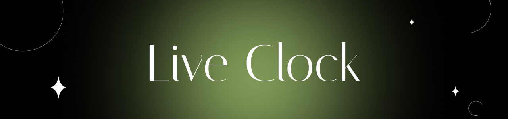
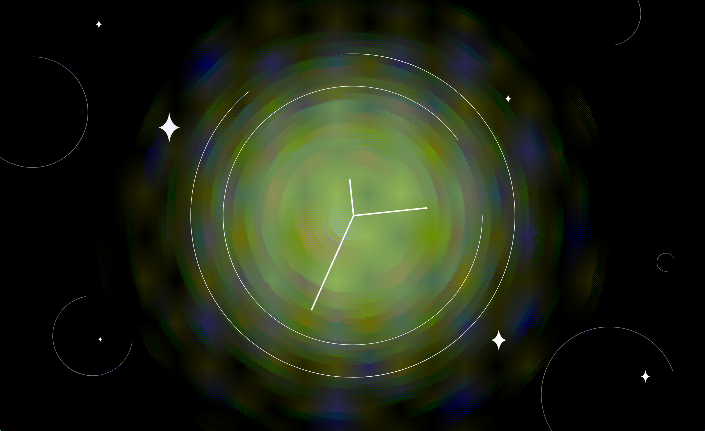

# Live Clock :clock5:

Простой сайт в космической тематике с часами, показывающими реальное время. :sparkles: Сайт адаптирован под все типы устройств. :iphone:

## Скриншоты

Посетите [сайт](https://id-andyyy.github.io/Live-Clock/) или посмотрите демонстрацию :point_down:

## Технологии и инструменты

Особенности:
- используется особый прием для вычисления адаптивных величин, используя возможности SCSS ([смотреть код](https://gist.github.com/id-andyyy/92bffcaa37c60c395324fe26b1a518d6))
- используется функция `circle-properties`, которая создаёт красивые настраиваемые полукольца ([смотреть код](scss/style.scss))
- сайт полностью адаптивен и подстраивается под любое устройство
- БЭМ методология
- чистый JS

## Обратная связь

Буду признателен, если вы поставите звезду. :star: Если вы нашли баг или у вас есть предложение, используйте раздел Issues.

## Благодарность

Благодарность за создание макета сайта [strawberry2892](https://github.com/strawberry2892). :strawberry: Сайт выполнен в рамках челленджа [JavaScript30](https://javascript30.com/).

Читать на [английском :uk:](README.md)